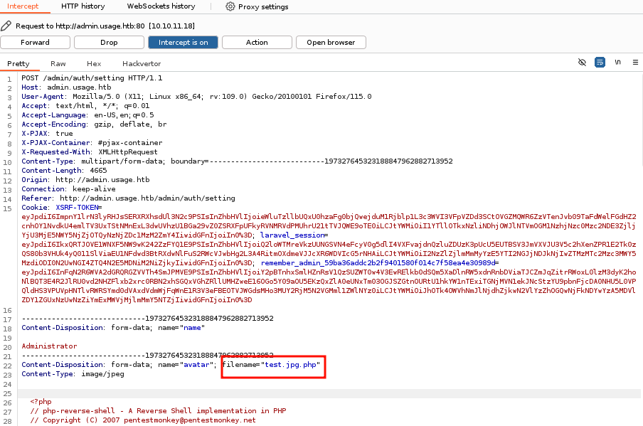
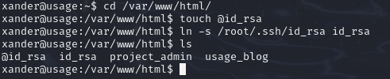

# Usage

Usage is a easy machine on HTB.

## Enumeration

First we check the open port via **nmap**.


The ports 22, 80 are open.
Let's check the port 80 first. For that we need to add the **domain** to our **hosts** file.

```bash
echo "10.10.11.18   usage.htb" | sudo tee -a /etc/hosts
```


This is what you should see after browsing to the domain. Let's **register** and **login** with our newly created account.


We are logged in but there is nothing of interest here. Let's go back to the login page.


We can see a **reset password** option. Click on it and try with the email of your account.


And if we try with a random email addresses we an error message.


It seems to use a database to verify if the email addresse is used by a user or not. So we can test for SQL injection vulnerability.

## Foothold

To test SQL injection we are going to use the `'` character. And if we put this character in the form to reset the password we obtain this page: 


The SQL injection seems to work ! We will use a tool called `sqlmap` to test different type of injection and retrieve information from the data base. For that we will need the **http request**. So open burpsuite and intercept the request.


Copy paste the request in a file. Now we can use sqlmap.

```bash
sqlmap -r http -p email --batch --level 5 --risk 3 --dbs
```


After a long time of sqlmap running, we obtain this result! We have three available databases. The **usage_blog** one is the most suspicious so let's begin by this one. Add `-D usage_blog` option at your sqlmap command

```bash
sqlmap -r http -p email --batch --level 5 --risk 3 --dbms=mysql -D usage_blog
```


And for the tables select admin_users.

```bash
sqlmap -r http -p email --batch --level 5 --risk 3 --dbms=mysql -D usage_blog -T admin_users --dump
```


We have a hash! Copy paste it into a file. We will use `hashcat` to crack it. First we need to determine what type of hash is it.

```bash
hashcat -a 0 hash /usr/share/wordlists/rockyou.txt
```

It seems to be a **bycript** one. Now that we know the type we can crack it.

```bash
hashcat -a 0 -m 3200 hash /usr/share/wordlists/rockyou.txt
```

And we have the password ! `admin:whatever1` we can try to login in the admin panel. But first we must add the domain to our host file because the admin login is in the subdomains `admmin.usage.htb`

```bash
echo "10.10.11.18   admin.usage.htb" | sudo tee -a /etc/hosts
```

## User flag

After logged in we have this dashboard.


We have a list of dependencies with the version of them. So we can search if some dependencies have CVE who are interesting. And there is one for the `encore/laravel-admin` dependencie. The [CVE-2023-24249](https://nvd.nist.gov/vuln/detail/CVE-2023-24249) allows attacker to execute **remote command** with crafted php file. So when we upload an image for the avatar, we can intercept the request and change the name of the file from `name.jpg` to `name.jpg.php` and the file will execute the php code of the file.

So for this i will use the pentestmonkey's reverse shell. Copy it to a file and rename that file to have the `.jpg` extension. Next upload it in the website.


Submit it and intercept the request in burpsuite. Add the `.php` at the filename variable



Forward the request and you should see this if it was successful


Now setup a **netcat** listener and click on the download file button.


And you should have a connection on your netcat.


Stabilize it with the following command

```bash
python3 -c 'import pty;pty.spawn("/bin/bash")'
# CTRL + Z
stty raw -echo; fg
```

We are the user **dash** and can found the user flag in it's home repository.


## Privilege escalation

If we do a simple `ls -la` we can see some unusual file in the home repository. Cat them to see what's inside.


There is a hardcoded password! But it doesn't work for the root user. But there is a another user named **xander**. And we successfuly login as this user with the password we found `xande:3nc0d3d_pa$$w0rd`.


Let's see if this users can use some commands as root with `sudo -l`.


We can use the script `usage_management` with sudo right. It seems to be a custom script so lets launch it.


So we have multiple option:
- Create a archive of the project
- Backup the mysql data
- Reset the admin password

To create the archive the script use **7-zip**. Reset the admin password unfortunatly don't seem vulnerable. We can use the command `strings` on the script to try to obtain more information.


So for the backup of the mysql data it use the command `/usr/bin/mysqldump -A > /var/backups/mysql_backup.sql` but we have already had access at the mysql database with sqlmap. So it doesnt seems to be the right path.

But for the archive it use the command `/usr/bin/7za a /var/backups/project.zip -tzip -snl -mmt -- *`. And after some research the option `-snl` open a vulnerability with symbolic link. See [this article on hacktricks](https://book.hacktricks.xyz/linux-hardening/privilege-escalation/wildcards-spare-tricks#id-7z) 

We want to log as root so we can try to leak the id_rsa of the root user. For this we must do:
- Go to /var/www/html/
- Touch @id_rsa
- Create a symbolic link of the root id_rsa



And now launch the script with sudo and choose the option 1


And we have it! Copy it to a file in our local machine and remove the error message. Don't forget to `chmod 600` the file.
Now try to login via **ssh**

```bash
ssh -i id_rsa root@10.10.11.18
```


